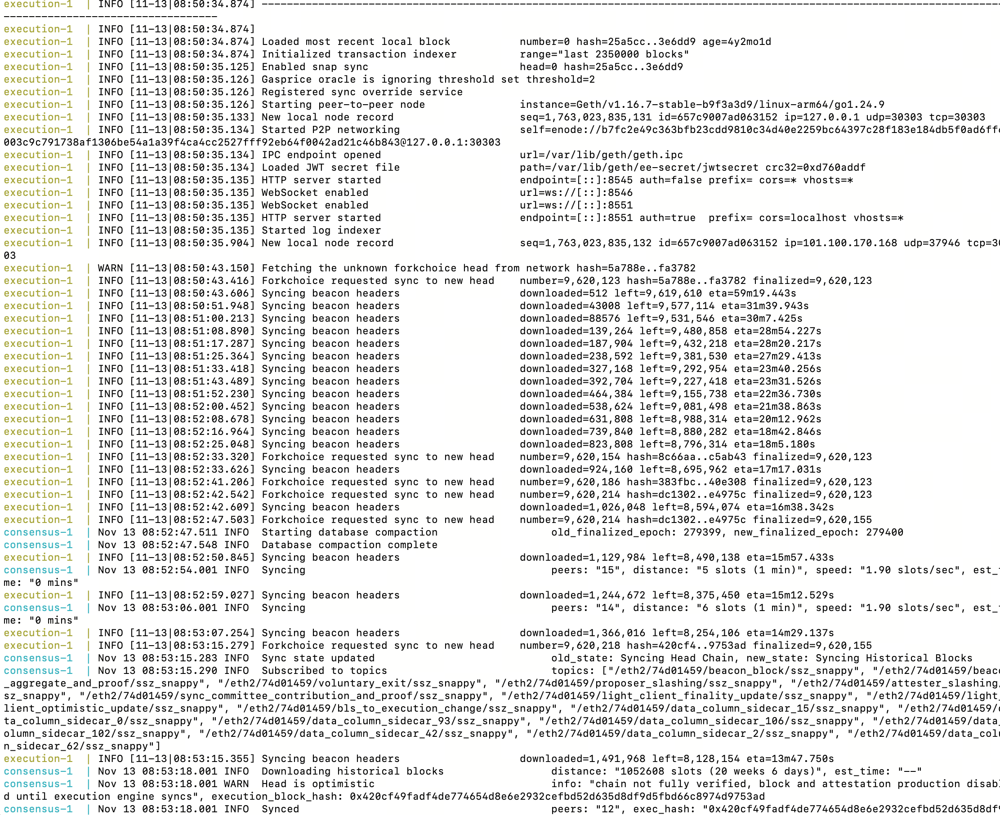
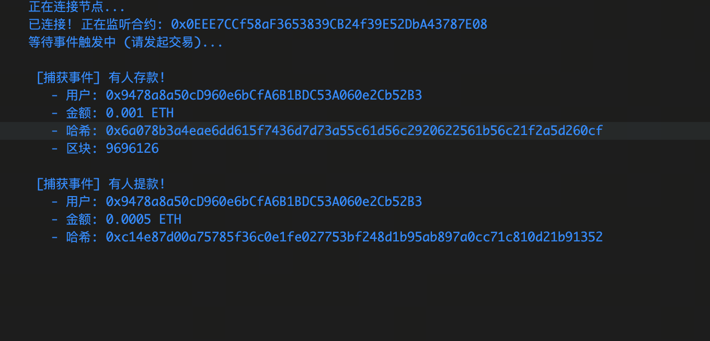
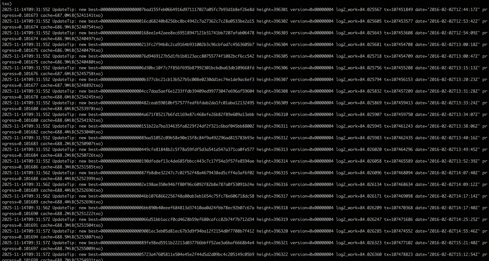
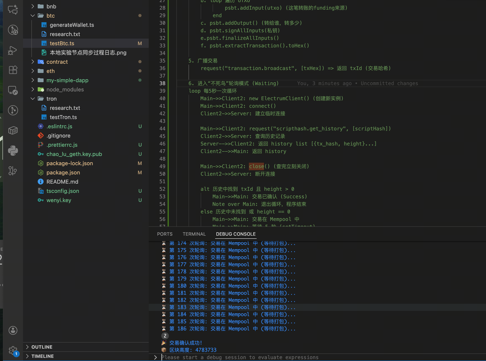

# Node Infrastructure Experiments: Ethereum, Base, Bitcoin, and Solana

## 0. Scope

This note records the node-infrastructure experiments that were actually run or researched during this phase of the project.

The note covers:

- Ethereum node setup and sync experiments, including full-node sync, storage reduction, and the tradeoff between full, aggressively pruned, and archive-style operation
- Base / OP Stack node setup experiments, including L1/L2 split, sync failures, storage pressure, and production-oriented configuration changes
- Bitcoin node research and supporting transaction-flow experiments
- Solana node research and the reason a full deployment was not attempted
- console evidence, screenshots, and implementation notes where they help explain the operational results


## 1. Motivation

The original motivation for running local nodes was practical rather than academic. The goal was to support low-latency and high-control blockchain workflows, including:

- direct RPC access without third-party rate limits
- block and event subscriptions over local infrastructure
- wallet and contract monitoring
- future strategy support for LP, arbitrage, and bot-style execution

Across chains, the experiments quickly showed that "running a node" is not one uniform problem. The architecture, storage model, indexing requirements, and maintenance burden differ substantially between Ethereum L1, Ethereum-family L2s such as Base, Bitcoin, and Solana.


## 2. Ethereum L1 Environment

The earlier Ethereum L1 experiment ran on DigitalOcean in Singapore (`sgp1`).

The environment facts relevant to the experiment are:

- provider: `DigitalOcean`
- region: `Singapore (sgp1)`
- compute plan: `DigitalOcean Standard` shared-CPU Droplet
- node stack: `geth + lighthouse`
- architecture: `linux/arm64`
- public node IP: `167.71.223.149`
- data path: `/mnt/volume_sgp1_01/docker-data/`
- attached data volume: `1,000 GiB` DigitalOcean Volumes Block Storage

The key infrastructure choice here was the use of a separate `1,000 GiB` block-storage volume for chain data rather than relying only on the Droplet's local boot disk.


## 3. Ethereum

### 3.1 Architecture and Setup

The Ethereum mainnet experiment used the standard post-Merge split:

- `Geth` as the execution client
- `Lighthouse` as the consensus client

This means:

- the execution layer served JSON-RPC over HTTP / WebSocket
- the consensus layer served beacon / validator-facing APIs
- the two components communicated through the Engine API with JWT authentication

The working references preserved in the notes were:

- Geth RPC namespaces: <https://geth.ethereum.org/docs/interacting-with-geth/rpc/ns-eth>
- Beacon API reference: <https://ethereum.github.io/beacon-APIs/#/Events/eventstream>
- Eth Docker: <https://ethdocker.com/>
- Geth history pruning: <https://geth.ethereum.org/docs/fundamentals/historypruning>

The notes also preserved a concise mental model:

- execution client = local database, state transition engine, JSON-RPC surface
- consensus client = fork choice, validator-facing consensus logic, chain coordination

That split mattered in practice because it shaped both the storage layout and the maintenance burden.


### 3.2 Mainnet Full-Node Experiment

The preserved timeline for the Ethereum mainnet full-node run is:

- `2025-11-18 6:30 p.m.`: `geth` and `lighthouse` installed and services started
- `2025-11-19 2:30 p.m.`: sync completed
- `2025-11-19 2:30 p.m.`: a TypeScript script successfully listened for new block creation events

This places the full sync duration at roughly twenty hours.

The notes also preserve that local event-listening code could subscribe to new blocks and contract events after sync completed. That matters because the infrastructure goal was not only to hold the chain locally, but to serve downstream application workflows.

Representative sync log screenshot:



Representative execution/consensus log lines preserved from the screenshot:

```text
execution-1 | INFO [...] Enabled snap sync                        head=0 hash=25a5cc..3e6dd9
execution-1 | INFO [...] Starting peer-to-peer node               instance=Geth/v1.16.7-stable-b9f3a3d9/linux-arm64/go1.24.9
execution-1 | INFO [...] Loaded JWT secret file                   path=/var/lib/geth/ee-secret/jwtsecret crc32=0xd760addf
execution-1 | INFO [...] Syncing beacon headers                   downloaded=1,491,968 left=8,128,154 eta=13m47.750s
consensus-1 | INFO [...] Downloading historical blocks            distance: "1052608 slots (20 weeks 6 days)"
consensus-1 | WARN [...] Head is optimistic                       info: "chain not fully verified, block and attestation production disabled until execution engine syncs"
consensus-1 | INFO [...] Synced                                   peers: "12"
```

After sync, `geth db inspect` reported a total database size of approximately `1.37 TiB`. The full preserved output is worth keeping because it shows where the space actually went.

```text
+-----------------------+-----------------------------+------------+------------+
|       DATABASE        |          CATEGORY           |    SIZE    |   ITEMS    |
+-----------------------+-----------------------------+------------+------------+
| Key-Value store       | Headers                     | 60.88 KiB  |         91 |
| Key-Value store       | Bodies                      | 10.53 MiB  |         91 |
| Key-Value store       | Receipt lists               | 9.77 MiB   |         91 |
| Key-Value store       | Difficulties (deprecated)   | 0.00 B     |          0 |
| Key-Value store       | Block number->hash          | 3.69 KiB   |         90 |
| Key-Value store       | Block hash->number          | 931.88 MiB |   23832732 |
| Key-Value store       | Transaction index           | 15.93 GiB  |  462203789 |
| Key-Value store       | Log index filter-map rows   | 5.23 GiB   |   54134607 |
| Key-Value store       | Log index last-block-of-map | 1.10 MiB   |      24130 |
| Key-Value store       | Log index block-lv          | 11.85 MiB  |     621305 |
| Key-Value store       | Log bloombits (deprecated)  | 0.00 B     |          0 |
| Key-Value store       | Contract codes              | 11.31 GiB  |    1919680 |
| Key-Value store       | Hash trie nodes             | 0.00 B     |          0 |
| Key-Value store       | Path trie state lookups     | 58.86 KiB  |       1470 |
| Key-Value store       | Path trie account nodes     | 51.81 GiB  |  450249852 |
| Key-Value store       | Path trie storage nodes     | 192.32 GiB | 1913035120 |
| Key-Value store       | Path state history indexes  | 0.00 B     |          0 |
| Key-Value store       | Verkle trie nodes           | 0.00 B     |          0 |
| Key-Value store       | Verkle trie state lookups   | 0.00 B     |          0 |
| Key-Value store       | Trie preimages              | 0.00 B     |          0 |
| Key-Value store       | Account snapshot            | 15.07 GiB  |  327422765 |
| Key-Value store       | Storage snapshot            | 101.95 GiB | 1413695758 |
| Key-Value store       | Beacon sync headers         | 655.00 B   |          1 |
| Key-Value store       | Clique snapshots            | 0.00 B     |          0 |
| Key-Value store       | Singleton metadata          | 696.15 KiB |         17 |
| Ancient store (Chain) | Headers                     | 11.59 GiB  |   23832642 |
| Ancient store (Chain) | Hashes                      | 863.69 MiB |   23832642 |
| Ancient store (Chain) | Bodies                      | 710.11 GiB |   23832642 |
| Ancient store (Chain) | Receipts                    | 287.41 GiB |   23832642 |
| Ancient store (State) | History.Meta                | 113.18 KiB |       1467 |
| Ancient store (State) | Account.Index               | 18.12 MiB  |       1467 |
| Ancient store (State) | Storage.Index               | 25.78 MiB  |       1467 |
| Ancient store (State) | Account.Data                | 19.54 MiB  |       1467 |
| Ancient store (State) | Storage.Data                | 8.51 MiB   |       1467 |
+-----------------------+-----------------------------+------------+------------+
|                                    TOTAL            |  1.37 TIB  | 4647141589 |
+-----------------------+-----------------------------+------------+------------+
```

Two observations from this output were especially important.

First, even a non-archive Ethereum full node was already expensive in storage terms. Second, the largest contributors were not abstract "state" in the narrow sense, but ancient chain bodies, receipts, and storage-related structures. That directly motivated the later pruning experiment.


### 3.3 Event and RPC Validation

After sync, the node was not only up but usable from application code. The surviving scripts show local and public-node tests for:

- `eth_subscribe` over WebSocket
- `newHeads` subscriptions
- log subscriptions for ERC-20 `Transfer` events
- post-processing blocks with TypeScript / `ethers`

One preserved event-listener screenshot shows successful detection of deposit and withdrawal events against a Sepolia contract:



That result is operationally important. It confirmed that the node was useful for exactly the category of workloads that motivated the experiment: reactive infrastructure, subscriptions, and application-layer monitoring.


### 3.4 Storage Reduction: Full Node to Aggressively Pruned Operation

The Ethereum experiment did not stop at "full sync succeeded." A detailed storage-reduction experiment followed.

#### 3.4.1 History Pruning with `geth prune-history`

After `geth` `v1.16`, the node supported history pruning. The notes describe this step as removing pre-Merge history while retaining more recent post-Merge data. The key operational property was:

- the node still retained the ability to answer some historical queries
- but the chain history footprint shrank substantially

The preserved post-pruning `db inspect` output dropped the total footprint from `1.37 TiB` to `1.02 TiB`.

```text
+-----------------------+-----------------------------+------------+------------+
|       DATABASE        |          CATEGORY           |    SIZE    |   ITEMS    |
+-----------------------+-----------------------------+------------+------------+
| Key-Value store       | Headers                     | 60.88 KiB  |         91 |
| Key-Value store       | Bodies                      | 10.53 MiB  |         91 |
| Key-Value store       | Receipt lists               | 9.77 MiB   |         91 |
| Key-Value store       | Difficulties (deprecated)   | 0.00 B     |          0 |
| Key-Value store       | Block number->hash          | 3.69 KiB   |         90 |
| Key-Value store       | Block hash->number          | 931.88 MiB |   23832732 |
| Key-Value store       | Transaction index           | 15.93 GiB  |  462203789 |
| Key-Value store       | Log index filter-map rows   | 5.23 GiB   |   54134607 |
| Key-Value store       | Log index last-block-of-map | 1.10 MiB   |      24130 |
| Key-Value store       | Log index block-lv          | 11.85 MiB  |     621305 |
| Key-Value store       | Log bloombits (deprecated)  | 0.00 B     |          0 |
| Key-Value store       | Contract codes              | 11.31 GiB  |    1919680 |
| Key-Value store       | Hash trie nodes             | 0.00 B     |          0 |
| Key-Value store       | Path trie state lookups     | 58.86 KiB  |       1470 |
| Key-Value store       | Path trie account nodes     | 51.81 GiB  |  450249852 |
| Key-Value store       | Path trie storage nodes     | 192.32 GiB | 1913035120 |
| Key-Value store       | Path state history indexes  | 0.00 B     |          0 |
| Key-Value store       | Verkle trie nodes           | 0.00 B     |          0 |
| Key-Value store       | Verkle trie state lookups   | 0.00 B     |          0 |
| Key-Value store       | Trie preimages              | 0.00 B     |          0 |
| Key-Value store       | Account snapshot            | 15.07 GiB  |  327422773 |
| Key-Value store       | Storage snapshot            | 101.95 GiB | 1413695767 |
| Key-Value store       | Beacon sync headers         | 655.00 B   |          1 |
| Key-Value store       | Clique snapshots            | 0.00 B     |          0 |
| Key-Value store       | Singleton metadata          | 696.15 KiB |         17 |
| Ancient store (Chain) | Headers                     | 11.59 GiB  |    8295249 |
| Ancient store (Chain) | Hashes                      | 863.69 MiB |    8295249 |
| Ancient store (Chain) | Bodies                      | 466.40 GiB |    8295249 |
| Ancient store (Chain) | Receipts                    | 170.73 GiB |    8295249 |
| Ancient store (State) | History.Meta                | 113.18 KiB |       1467 |
| Ancient store (State) | Account.Index               | 18.12 MiB  |       1467 |
| Ancient store (State) | Storage.Index               | 25.78 MiB  |       1467 |
| Ancient store (State) | Account.Data                | 19.54 MiB  |       1467 |
| Ancient store (State) | Storage.Data                | 8.51 MiB   |       1467 |
+-----------------------+-----------------------------+------------+------------+
|                                    TOTAL            |  1.02 TIB  | 4647141606 |
+-----------------------+-----------------------------+------------+------------+
```

This was an important intermediate point. It showed that there was real space to recover without immediately giving up all historical utility.

#### 3.4.2 Further Reduction with `geth removedb --remove.chain`

The next step was much more aggressive:

```text
geth removedb --remove.chain
```

After that step, the surviving disk-usage note recorded:

```text
sudo du -sh /mnt/volume_sgp1_01/docker-data/
390G    /mnt/volume_sgp1_01/docker-data/
```

This is the most dramatic storage result in the surviving materials:

- full node after sync: about `1.37 TiB`
- pruned history: about `1.02 TiB`
- after removing chain history aggressively: about `390 GiB`

In operational terms, this transformed the node from a normal full node into something much closer to a highly pruned state-serving node. Strictly speaking, this was **not** a protocol light client in Ethereum's formal sense, but it behaved much more like a "lightweight current-state node" than a full historical node.


### 3.5 What Was Lost After Aggressive Compaction

The notes explicitly state that after `geth removedb --remove.chain`, the node lost the ability to query historical transactions. That loss should be stated clearly because it is the central tradeoff of the compression experiment.

The surviving note phrases it as:

- "the node at this point loses the ability to query historical transactions"

Operationally, that implies the following losses or degradations:

- old block bodies and receipts are no longer locally available
- arbitrary historical transaction lookup is no longer reliable
- historical event backfill becomes incomplete or impossible without an external provider
- explorer-style or analytics-style workloads are no longer appropriate
- the node becomes suitable mainly for current-state RPC and forward-looking subscriptions

This distinction matters because the compression experiment did not merely make the node "smaller." It changed the class of workloads the node could support.

That is exactly why this experiment is worth recording. It demonstrates that storage optimization is not a free win. It is a functional tradeoff between:

- current-state serving
- historical query support
- infrastructure cost


### 3.6 Restart Cost After Compaction

The notes also preserve an important downside of aggressive compaction:

- after restart, `geth` spent a long time in `heal state`
- this recovery process consumed significant CPU and disk I/O
- the node effectively stalled in a heavy startup / repair phase

This is worth preserving because it shows that "compressed" does not necessarily mean "cheap to operate." A very small on-disk footprint may still come with painful restart behavior.


### 3.7 Why an Archive Node Was Not the Right Target

The surviving notes do not show an archive-node deployment, and that was the right choice for this stage of the project.

There were two reasons.

First, the target workloads did not require archive semantics. The practical goals were:

- block subscriptions
- event monitoring
- wallet and contract tracking
- bot-facing RPC access for current state

Those use cases need a reliable current-state node far more than they need all historical state from genesis.

Second, the storage pressure was already significant even for a non-archive setup. The full-node experiment consumed roughly `1.37 TiB` before pruning. Under that constraint, an archive node would have increased both cost and operational fragility without serving the primary use case.

So the decision not to run archive was not arbitrary. It was a deliberate choice to optimize for operational usefulness rather than maximal historical completeness.


### 3.8 Other Ethereum-Family Side Experiments

The Ethereum notes also preserve several side experiments that were useful even though they were not the main focus.

#### 3.8.1 Sepolia with Nethermind + Lighthouse

A Sepolia node was deployed with:

- `Nethermind` as execution client
- `Lighthouse` as consensus client

The reason for trying this combination was that Nethermind supported `prune-mode=full`, making it more attractive for lower-disk environments.

#### 3.8.2 Nethermind Upgrade / Downgrade Tests

The notes record the following upgrade and downgrade checks:

- `1.35.2` -> `1.35.1`: worked
- `1.35.1` -> `1.35.2`: worked
- `1.35.2` -> `1.34.1`: worked

This matters because it suggests that version rollback within the same client family was operationally manageable in that environment.

#### 3.8.3 Cross-Client Data Incompatibility

One especially useful observation was:

- switching from Nethermind to Geth did **not** reuse Nethermind's local chain data
- Geth ignored the existing data and started downloading from zero

This is exactly the kind of operational fact that often gets overlooked in high-level architecture discussions. In practice, execution clients are not simply interchangeable against the same local database.

#### 3.8.4 Zora Sepolia

An attempt was made to build Base first, but the notes record that the storage requirement was too high, with an estimated need around `6 TB` for that attempt. Instead, a `zora-sepolia` setup was brought up successfully, using the locally deployed Sepolia L1 for the EL / CL dependencies. The notes estimate Zora's data size around `150 GB`.


### 3.9 Base / OP Stack Experiments

The Base experiments were important enough that they should not be treated as a footnote to the Ethereum L1 work. In practice, Base was the experiment where the gap between nominal documentation and operational reality became most obvious.

#### 3.9.1 Initial Goal and Architecture

The original goal was:

- run a local Ethereum L1 node, initially with `reth`
- run a local Base mainnet node on top of that
- later use the local Base node for LP, arbitrage, and sniper-style workflows

The preserved notes correctly framed Base as an OP Stack system with two required components:

- `op-geth` as the L2 execution client
- `op-node` as the rollup / consensus client

This architecture mattered because the L2 execution client is not self-sufficient in the same way that a plain Ethereum L1 execution client is. `op-geth` must be driven by `op-node`.

#### 3.9.2 Recovered Machine Parameters

Unlike the earlier Ethereum mainnet experiment, the Base note preserves much more concrete hardware information.

The initial Base machine was on OVHcloud in Virginia and recorded:

- CPU: `AMD EPYC 4244P 6-Core Processor`
- logical CPUs: `12`
- RAM: about `62 GiB`
- storage: two ~`894 GB` NVMe devices in `RAID 0`
- filesystem: `ext4`
- usable root volume: about `1.8 TB`

The preserved system excerpt is:

```text
CPU(s):                               12
Model name:                           AMD EPYC 4244P 6-Core Processor
Mem:                                  62Gi
/dev/md2       ext4                   1.8T
```

That machine profile is important because it was already meaningfully stronger than a minimal hobby setup. The Base problems therefore cannot be dismissed as just underpowered hardware.

#### 3.9.3 Why the First Attempt Failed

The first important Base lesson was architectural rather than resource-related.

The failure mode was:

- `op-geth` started correctly
- snap sync appeared to be enabled
- but the execution layer sat at `block 0` and did not move

The preserved debugging conclusion was:

- on Base, `op-geth` cannot meaningfully sync by itself
- `op-node` must connect to L1 and to the Base P2P network
- `op-node` must drive `op-geth` over the Engine API

Representative preserved lines from the earlier console investigation include:

```text
> eth.blockNumber
0
```

and:

```text
Enabled snap sync head=0
```

The key interpretation was that `op-geth` believed the target head was still zero, so it had no reason to advance.

That in turn led to the most important functional correction in the Base setup:

```text
--syncmode=execution-layer
```

The earlier note identifies this parameter as the decisive fix, taken from the OP Stack snap sync guidance. Once `op-node` was configured to use execution-layer sync, `op-geth` could finally begin a real snap-sync trajectory instead of idling at genesis.

#### 3.9.4 Final Working Base Compose Shape

The final working setup was organized around two services:

- `execution` = `op-geth`
- `consensus` = `op-node`

The execution side used the following key options:

```yaml
- --syncmode=snap
- --gcmode=full
- --networkid=8453
- --op-network=base-mainnet
- --state.scheme=path
- --db.engine=pebble
```

The consensus side used:

```yaml
- --network=base-mainnet
- --l1=${L1_RPC_URL}
- --l1.beacon=${L1_BEACON_URL}
- --l2=http://execution:8551
- --l2.jwt-secret=/jwt.hex
- --l1.trustrpc
- --l1.rpckind=alchemy
- --syncmode=execution-layer
```

There were also some practical but important operational decisions in the final setup:

- the JWT secret was generated once and mounted into both services
- L1 RPC endpoints were moved into `.env`
- Docker was installed from Docker's official repository rather than Ubuntu's older packages
- the node directory structure was normalized under `~/node`

#### 3.9.5 Why Local L1 Was Eventually Deprioritized

A major decision in the Base experiments was whether to keep running a local Ethereum L1 node at all.

The final practical conclusion was:

- if the goal is trading and current-state access on Base, a remote L1 RPC is usually sufficient
- local disk should be prioritized for the Base node itself

The note preserved the reasoning clearly:

- `op-node` only needs L1 data to validate and finalize the Base chain
- the most latency-sensitive part of bot operation depends much more on receiving new L2 heads than on running a local L1 archive or full node
- if the strategy is not based on cross-chain atomic arbitrage or L1 deposit detection, then local L1 infrastructure does not justify its storage cost

This was one of the most useful infrastructure conclusions in the whole Base section: local L1 was optional for the actual trading-oriented workload.

#### 3.9.6 Storage Pressure and the Documentation Gap

The most painful Base lesson was that the official or semi-official hardware guidance was materially too optimistic for a comfortable production-like setup.

The earlier note repeatedly documented the mismatch:

- `16 GB RAM` may appear as a formal minimum
- `32 GB` is only marginal in practice
- `64 GB` is the safer operational target

Likewise for storage:

- a `2 TB` recommendation looks plausible on paper
- but a usable `1.8 TB` volume turned out to be extremely fragile for Base

The Base note explicitly records the operational conclusion that a `1.8 TB` disk was too close to the edge once real sync-time write amplification and state growth were involved.

That was the central reason the Base experiment mattered: it exposed the difference between documentation-level requirements and repeatably workable infrastructure.

#### 3.9.7 PBSS and Pebble as the Real Storage Fix

The second decisive fix, after `--syncmode=execution-layer`, was enabling:

```text
--state.scheme=path
--db.engine=pebble
```

The note identifies this as the real storage-saving configuration for `op-geth`.

The preserved interpretation was:

- path-based state storage (`PBSS`) reduced state overhead substantially
- Pebble was the preferred backend for this mode
- without PBSS, Base full-node storage pressure on a `1.8 TB` volume was not sustainable

The earlier investigation estimated:

- Base full node under default or inefficient storage assumptions: roughly `1.2-1.6 TB` or more
- Base full node with PBSS enabled: closer to `1.1-1.4 TB`

The note also explicitly describes PBSS as saving roughly `30%-50%` of state-storage overhead.

The key preserved confirmation lines were:

```text
INFO ... Using pebble as db engine
INFO ... State scheme set by user                 scheme=path
```

Those lines mattered because they confirmed that the intended storage mode had actually taken effect.

#### 3.9.8 Representative Base Logs Worth Preserving

The earlier Base write-up preserved several representative logs that are worth keeping because they distinguish alive-but-stuck from correctly syncing.

Stalled execution-layer state:

```text
INFO [...] Loaded most recent local block           number=0
INFO [...] Enabled snap sync                        head=0
INFO [...] Looking for peers                        peercount=0
INFO [...] Looking for peers                        peercount=2
```

Healthy post-fix state:

```text
INFO [...] Using pebble as db engine
INFO [...] State scheme set by user                 scheme=path
INFO [...] Syncing beacon headers downloaded=1,501,184 left=38,199,022 eta=27m18.001s
```

The preserved estimate after the Base node entered the healthy sync path was:

- header sync: about `30-40 minutes`
- state sync: about `8-12 hours`
- final occupied space under PBSS: around `1.1-1.3 TB`

Even if those numbers were approximate, they were operationally useful because they anchored expectations far better than a generic "it depends."

#### 3.9.9 Main Base Pitfalls

The Base experiments produced a compact but valuable list of pitfalls.

First, an L2 execution client is not an L1 execution client. Running only `op-geth` does not force a usable Base sync.

Second, JWT handling matters. If `op-node` and `op-geth` do not mount the exact same JWT secret, Engine API communication fails.

Third, low peer count can create misleading symptoms. A node may appear healthy but progress too slowly because P2P connectivity is weak.

Fourth, `--gcmode=archive` on the wrong template is disastrous for this workload. The preserved note even caught an early incorrect compose example with archive mode still present.

Fifth, if Ethereum L1 and Base L2 are both placed on the same already-constrained disk, the storage plan breaks down immediately.

Sixth, Docker permissions on a fresh Ubuntu machine can stop the deployment before any blockchain-specific debugging even begins:

```text
permission denied while trying to connect to the Docker daemon socket at unix:///var/run/docker.sock
```

That error was not a Base protocol issue. It was a host setup issue resolved by adding the user to the `docker` group.

#### 3.9.10 Why Archive Was Not the Right Base Target

The preserved Base note is very clear that archive-style operation was not the right target.

The reasons were the same in spirit as on Ethereum L1, but even stronger on Base:

- the workload was current-state RPC and event-driven trading
- full historical trace completeness was not needed
- archive mode would have made storage requirements explode
- the machine budget was already under strain even for a carefully tuned full node

In other words, for this project, archive mode would have consumed large amounts of hardware budget while contributing little to the intended application.

#### 3.9.11 Larger-Machine Evaluation

The note also preserved a later machine-evaluation thread for a larger OVH setup. The relevant conclusions were:

- CPU quality mattered a lot, and the `AMD EPYC 4244P` class was considered excellent
- `32 GB` RAM was judged merely acceptable, not comfortable
- `64 GB` RAM was the more realistic production target
- `4 x 960 GB NVMe` in `RAID 0` for roughly `3.84 TB` total was considered the first genuinely comfortable storage tier

That evaluation is worth preserving because it translates the Base debugging experience into a clearer infrastructure recommendation.


## 4. Bitcoin

### 4.1 Architecture

The Bitcoin notes emphasize a key difference from Ethereum.

Bitcoin Core is a monolithic client:

- there is no execution-layer / consensus-layer split like post-Merge Ethereum
- the core node validates blocks, participates in P2P, and stores chain data directly

The preserved architecture notes distinguish two layers:

- `bitcoind` / Bitcoin Core as the base ledger node
- an Electrum-compatible indexer layer such as `Electrs` or `ElectrumX` for wallet-facing queries

This difference is important. Ethereum's account model makes balance and log queries natural at the node level. Bitcoin's UTXO model does not naturally expose "all history for this address" from the base node. For wallet or product development, an indexer layer becomes much more important.

The preserved references were:

- Bitcoin Core RPC: <https://developer.bitcoin.org/reference/rpc/>
- Electrum protocol: <https://electrumx.readthedocs.io/en/latest/protocol.html>


### 4.2 Research and Implementation Direction

The surviving Bitcoin code and notes show two parallel tracks:

1. node-level research on Bitcoin Core plus Electrum-style indexing
2. a TypeScript transaction-flow experiment using PSBT construction and Electrum-compatible RPC calls

The TypeScript flow in `testBtc.ts` preserved the practical sequence well:

- initialize wallet from WIF
- derive script hash
- connect to an Electrum-compatible endpoint
- fetch UTXOs
- build and sign a PSBT
- broadcast the transaction
- poll until confirmation

This is useful because it captures how Bitcoin wallet infrastructure differs from Ethereum application infrastructure. The node is not enough by itself; query ergonomics depend heavily on the indexing layer.


### 4.3 Sync Evidence and Confirmation Evidence

The surviving Bitcoin sync screenshot shows a local node progressing through historical blocks:



Representative log excerpt:

```text
2025-11-14T09:31:55Z UpdateTip: new best=... height=396301 ... cache=687.0MiB
2025-11-14T09:31:57Z UpdateTip: new best=... height=396321 ... cache=688.7MiB
```

This is a simple but useful sanity check: the base node was indeed syncing rather than only being researched abstractly.

There is also a preserved screenshot from the wallet / polling workflow:



That screenshot is not a node benchmark, but it is still relevant evidence. It shows the application-layer experiment repeatedly polling transaction status until confirmation, which reinforces the note's architectural point that Bitcoin wallet products often depend on an indexed view rather than raw node RPC alone.


### 4.4 Why Bitcoin Was Operationally Easier Than Ethereum

The preserved Bitcoin notes estimate much lighter hardware requirements than Ethereum:

- CPU: `2` cores
- RAM: `2-4 GB`
- storage for a full node around `650 GB` as of the note
- a pruned node can go much lower

That difference matters. Compared with Ethereum mainnet, Bitcoin was not the chain where storage architecture became the dominant blocker. The main design issue was query shape and indexing, not node survivability under multi-terabyte state growth.


## 5. Solana

### 5.1 Scope of the Solana Work

Unlike Ethereum, Solana was **not** deployed as a local full node in this phase. The surviving materials show only research and a small WebSocket-listening prototype.

The Solana experiment therefore remained at the stage of:

- reading official operational guidance
- understanding RPC / validator architecture
- testing basic subscription logic against a public endpoint

That is still worth recording because the decision not to deploy was itself an engineering conclusion rather than a missing task.


### 5.2 Why Solana Was Not Deployed

The preserved research notes list hardware expectations roughly as follows:

- CPU: `12 cores / 24 threads` or better
- RAM: minimum `128 GB`, with `256 GB` preferred
- account disk: `500 GB+` fast NVMe
- ledger disk: `2 TB+`
- network: `1 Gbit/s` symmetric, with very high monthly traffic

The notes also emphasize two operational difficulties:

- frequent software updates
- expensive restarts because snapshot and index loading can take a long time

For the purposes of this project, that combination made Solana qualitatively different from Ethereum and Bitcoin. Even before application logic was considered, the infrastructure burden was high enough that a local full-node experiment was not justified at this stage.


### 5.3 Architectural Difference from Ethereum and Bitcoin

The Solana notes preserved one useful contrast:

- a standard Solana RPC node only keeps recent ledger state efficiently
- historical or filtered data often requires a Geyser plugin streaming into an external database

So the indexing problem on Solana is again different from both Ethereum and Bitcoin:

- Ethereum exposes rich state and log semantics directly through RPC
- Bitcoin requires an address-oriented indexing layer for many wallet use cases
- Solana often requires a streaming / external-database layer for durable historical access


## 6. Lessons

Several conclusions emerged from these experiments.

### 6.1 Documentation Minimums and Practical Operation Are Not the Same

Ethereum and Base were the clearest examples. A node can be "supported" in theory while still proving too large, too slow, or too fragile for the intended workload under realistic infrastructure constraints.

### 6.2 Storage Is Not Just a Cost Variable; It Changes Functionality

The Ethereum compression experiment is the strongest example in this note:

- `1.37 TiB` full node
- `1.02 TiB` after history pruning
- `390 GiB` after aggressive chain removal

That was not only a storage optimization. It changed what the node could do.

### 6.3 Client Choice Has Operational Consequences Beyond Speed

The Sepolia side experiments showed that:

- some clients expose pruning modes more conveniently than others
- rollback behavior can differ
- switching clients does not mean local data portability

### 6.4 Indexing Requirements Depend on the Chain's Data Model

The experiments reinforced a useful systems-level distinction:

- Ethereum's account model makes node-level RPC powerful for applications
- Base inherits much of Ethereum's RPC ergonomics, but its OP Stack architecture adds a second layer of operational coupling between the rollup node and the execution client
- Bitcoin's UTXO model pushes many wallet tasks toward Electrum-style indexing
- Solana often pushes durable history and advanced queries into Geyser plus external databases


## 7. Summary

Ethereum and Base were the core results of this phase. The Ethereum work showed that a local mainnet node was feasible and useful, but also that storage pressure quickly forced explicit tradeoffs between full-node completeness and lightweight operational footprints. The full-node sync and the subsequent pruning experiment were both successful, and the transition from roughly `1.37 TiB` to `390 GiB` is the single clearest storage-reduction result in the surviving materials. That reduction, however, came at the cost of historical-query capability, which is precisely why the result is worth documenting carefully.

The Base work exposed a different class of problem. The main difficulty was not only chain size, but also the fact that an OP Stack node cannot be treated like a simple L1 execution client. The decisive fixes were architectural and operational: `op-node` had to drive `op-geth` correctly, `--syncmode=execution-layer` had to be enabled, and path-based state storage with Pebble had to be used to keep a full node viable on finite disks. The Base note therefore became the clearest example of how much real-world node operation can diverge from nominal documentation.

Bitcoin was easier from a raw infrastructure perspective, but more dependent on an indexing layer for product-like query patterns. Solana, by contrast, remained at the research stage because its hardware and operational requirements were materially higher than what this project needed at the time.

Taken together, these experiments support a simple conclusion: node strategy should be chosen around the actual workload. If the goal is current-state RPC, subscriptions, and reactive application infrastructure, then a carefully pruned node may be the right answer. If the goal is historical analytics, deep tracing, or explorer-like completeness, then archive-style infrastructure becomes a different and much more expensive project.
