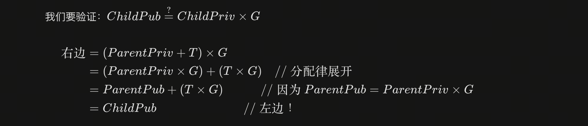
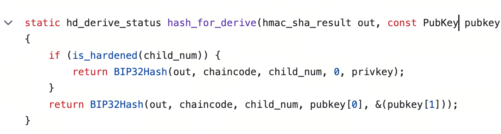
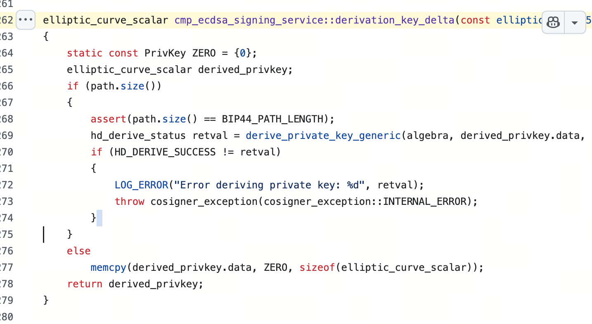

# BIP32, HD Wallets, and Hardened Derivation in MPC

## 0. Scope

This note covers:

- BIP32 and HD-wallet basics relevant to threshold signing
- why HD-wallet semantics matter for institutional custody
- what the `cggmp24-bip32` experiment actually demonstrates
- why non-hardened derivation fits threshold signing much more naturally than hardened derivation
- why true BIP32-hardened support is difficult in MPC
- what solution families exist in practice
- what can and cannot be concluded from public materials released by ChainUp, Fireblocks, and Coinbase

This note does not attempt to provide:

- a full tutorial on BIP32 or BIP44
- a full survey of threshold HD-wallet literature
- a claim that any vendor's production system has been fully verified from public code alone

The note focuses on HD-wallet derivation under threshold signing and its implications for institutional custody systems.

## 1. Motivation

Threshold signing solves only part of the custody problem. Institutional custody systems do not manage one static signing key. They manage a hierarchy of addresses, accounts, and operational sub-wallets. That hierarchy is usually expressed through HD-wallet semantics.

For that reason, threshold signing and HD-wallet derivation have to be analyzed together:

- threshold signing determines how control of a key is distributed
- HD-wallet derivation determines how one root expands into many operational keys
- hardened and non-hardened derivation determine whether child derivation can remain in the public domain or has to cross the secret boundary

For institutional custody, that distinction matters because address fan-out, account separation, audit workflows, and wallet recovery all depend on derivation semantics, not just on the signature algorithm.

## 2. BIP32 and HD Wallet Basics

BIP32 defines a hierarchical deterministic wallet structure in which one root extends into a tree of child keys.

The important objects are:

- a private key scalar
- the corresponding public key
- a 32-byte chain code
- an extended private key, which carries private-key material plus chain code
- an extended public key, which carries public-key material plus chain code

The chain code is not a public key and not a private scalar. It is auxiliary derivation material that allows the tree to evolve from one level to the next.

In ordinary single-device BIP32, this gives two useful capabilities:

- an extended private key can derive both child private keys and child public keys
- an extended public key can derive child public keys only, but only for non-hardened paths

This is exactly why non-hardened derivation is operationally useful. It lets a system generate addresses from public material without exposing signing authority.

The core distinction is between two derivation modes.

### 2.1 Non-Hardened Derivation

In non-hardened derivation, the tweak is computed from:

- the parent public key
- the parent chain code
- the child index

That allows `CKDpub` and `CKDpriv` to remain aligned. The child public key can be computed from public information alone.

### 2.2 Hardened Derivation

In hardened derivation, the tweak is computed from:

- the parent private key
- the parent chain code
- the child index

That breaks public derivation intentionally. A parent extended public key is no longer enough to derive child public keys for hardened indices.

This is the security and product distinction that matters later in MPC. Non-hardened derivation preserves a public derivation path. Hardened derivation removes it.

## 3. What the Experiment Shows

The `cggmp24-bip32` experiment demonstrates that non-hardened HD derivation can be integrated into threshold signing in a fairly clean way.

The experiment uses:

- `cggmp24` with the `hd-wallet` feature enabled
- a `3-of-3` DKG flow
- a secp256k1 root key plus chain code
- derivation along the path `m/0/0`
- threshold signing for an Ethereum transaction under that child path
- an independent BIP32 re-derivation check outside the MPC library

The important result is not merely that the code signs. The important result is that the derivation semantics remain externally consistent with standard non-hardened BIP32.

The experiment shows three things.

First, the DKG flow is initialized with HD-wallet support enabled, so the root key material is created together with chain-code material rather than bolting derivation on afterward.

Second, signing under `m/0/0` is treated as a derivation-path adjustment to the signing state rather than as a separate key-generation ceremony. In the experiment, this is implemented as a derivation step that adds no extra network rounds.

Third, `verify_bip32.py` independently replays standard `CKDpub` on the root public key and root chain code and reaches the same child public key that the MPC signing flow targets. That matters because it shows the child key is not merely internal to the MPC library. It remains compatible with ordinary BIP32 public derivation.

The math behind that result is the familiar non-hardened identity:

$$I = \text{HMAC-SHA512}(c_{par}, \text{serP}(K_{par}) \parallel i)$$

$$k_i = k_{par} + \text{parse256}(I_L) \pmod n$$

$$K_i = K_{par} + \text{parse256}(I_L)\cdot G$$

Because the parent public key and parent chain code are available, every party can compute the same tweak `parse256(I_L)` locally. That makes the threshold version structurally simple: each party updates its share by the same public tweak, and the resulting shares represent the child private key.

This is the key reason non-hardened derivation fits MPC well. The derivation step is still attached to secret shares, but the tweak itself comes from public inputs.

## 4. Why Hardened Derivation Is Hard in MPC

Hardened derivation removes exactly the property that makes non-hardened derivation easy.

In standard BIP32, hardened `CKDpriv` changes the hash input to include the parent private key rather than the parent public key:

$$I = \text{HMAC-SHA512}(c_{par}, 0x00 \parallel \text{ser256}(k_{par}) \parallel i)$$

The difficulty is immediate:

- the parent chain code may be available
- the child index is available
- but the parent private scalar is not known by any single party in an MPC system

That means the parties cannot simply compute the BIP32 tweak locally and then add it to their shares. The derivation primitive itself now depends on secret-shared input.

This is the real boundary:

- non-hardened derivation reduces to public-tweak computation plus local share update
- hardened derivation requires secure evaluation of a hash/PRF over secret-shared key material

So the problem is not that hardened derivation is conceptually impossible in MPC. The problem is that it stops being a cheap algebraic adjustment and becomes a cryptographic subprotocol in its own right.

This also explains why claims of "supports hardened derivation" should be read carefully. That sentence can mean very different things:

- true BIP32-hardened derivation performed without reconstructing the parent private key
- a proprietary derivation mechanism that behaves similarly at the product layer
- a trusted-dealer or enclave-assisted shortcut
- a workflow that reconstructs and reshards behind the scenes

Those are not the same property.

## 5. Solution Families

There are three broad ways to deal with hardened derivation in MPC systems.

### 5.1 Secure Circuit or MPC Evaluation of the Derivation Function

The most direct approach is to keep BIP32 semantics intact and evaluate the hardened derivation primitive inside MPC.

That means securely computing something HMAC-like over:

- the parent private scalar in shared form
- the parent chain code
- the child index

This preserves the closest possible compatibility with standard hardened BIP32. It also explains why the problem is expensive. SHA-512 and HMAC are not linear over secret shares, so this route usually means circuit-style secure computation, garbled-circuit style components, or a specialized MPC-friendly implementation of the same primitive.

This is the cleanest answer cryptographically, but it is also the heaviest answer operationally.

### 5.2 Replace BIP32's HMAC with an MPC-Friendly Derivation Primitive

The second approach is to preserve the product goal of hierarchical derivation while giving up exact BIP32 semantics.

In this model, the system replaces the hardened tweak function with something that can be evaluated over shared secret state more naturally, for example a linear PRF- or VRF-like construction. The child key tree can still behave like an HD tree operationally, but the derivation function is no longer standard `CKDpriv`.

This is often a more practical engineering choice, but the cost is interoperability. Once the derivation primitive changes, export/import behavior no longer matches standard BIP32 by default.

### 5.3 Trusted Helper, Enclave, or Reconstruct-and-Reshare Workflow

The third approach is to keep the product experience simple by relaxing the pure MPC boundary.

Examples include:

- deriving inside a trusted execution environment
- reconstructing under tightly controlled conditions and then resharing
- delegating derivation to a trusted dealer or other privileged component

These approaches may be operationally useful, but they should not be described as equivalent to pure threshold BIP32-hardened derivation.

## 6. Industry Observations

### 6.1 ChainUp

ChainUp publicly documents an MPC wallet product, multi-chain support, and a BIP44-style address path structure for wallet addresses [R1][R2]. That is enough to show that HD-wallet concepts exist at the product layer.

It is not enough to verify the cryptographic implementation of hardened derivation.

No public derivation library or threshold HD-wallet implementation was available in the reviewed materials to independently verify:

- whether hardened derivation is performed in a truly threshold manner
- whether the derivation function is standard BIP32-compatible
- whether any trusted component is involved

So for research purposes, ChainUp is best treated as a product claim rather than as auditable cryptographic evidence.

### 6.2 Fireblocks

Fireblocks is more interesting because it has a public `mpc-lib` repository. The public code is useful not because it proves the full production design, but because it exposes where the hardened boundary actually appears.

Two pieces of evidence matter.

First, in `src/common/blockchain/mpc/hd_derive.cpp`, the hardened branch switches from the public-key derivation path to the private-key derivation path, and public-only derivation rejects hardened indices [R3]. This is the standard BIP32 distinction made explicit in code rather than only in documentation.

Second, the more revealing code path is the higher-level `cmp_ecdsa_signing_service::derivation_key_delta(...)` routine. In that path, the code defines a zero private key and calls the generic private-derivation helper with that zero value in order to obtain a derivation delta that can later be added to the MPC signing state.

That observation matters more than the lower-level hash branch, because it shows how derivation is connected to the MPC signing flow. The code is not simply deriving a full child private key in the ordinary single-device sense. It is extracting an additive delta from the derivation function.

For non-hardened derivation, this makes good algebraic sense. The child-key tweak is public-key based, so deriving from zero can be used as a way to isolate the path-dependent offset that must be added to the existing secret shares.

For hardened derivation, however, standard BIP32 would require the tweak to depend on the actual parent private key. Replacing that input with zero makes standard BIP32 equivalence non-obvious. The public code therefore supports a narrower conclusion:

- Fireblocks clearly treats hardened derivation as a private-input problem at the lower derivation layer
- the higher signing-service path appears to recast derivation as an additive delta by deriving from zero
- from the public repository alone, this is not enough to conclude that the production MPC stack implements standard BIP32-hardened derivation in a transparent and verifiable way

For research purposes, the more defensible statement is therefore not that Fireblocks publicly demonstrates hardened support, but that its public repository does not provide convincing evidence of standard BIP32-hardened support. At minimum, the public implementation is not transparent enough to treat "hardened supported" and "standard BIP32-hardened support verified" as the same claim.

That is the main research value of the Fireblocks material. It does not settle the production architecture, but it does show exactly where the tension lies between BIP32 semantics and MPC-friendly additive derivation.

### 6.3 Coinbase

Coinbase is the clearest public example of the second solution family.

Its official `cb-mpc` repository states that the `HD-MPC` example is "not BIP32-compliant, but is indistinguishable from it" and points readers to `docs/theory/mpc-friendly-derivation-theory.pdf` [R4][R5]. That sentence is important because it states the tradeoff directly: Coinbase wants HD-wallet behavior without claiming exact BIP32 semantics.

The corresponding source code implements hardened derivation through a different primitive rather than through standard BIP32 HMAC over the parent private key [R6]. The derivation path runs through a two-party VRF-like computation that outputs the tweak used to update the private-key shares. In other words, Coinbase solves the "private key is unavailable as a single value" problem by redesigning the derivation primitive so that the tweak can be generated from shares directly.

That is a legitimate solution, but it changes interoperability.

Once the hardened derivation function is no longer BIP32 `CKDpriv`, ordinary extended-key recovery semantics no longer follow automatically. Operationally, recovering the same child tree requires the Coinbase derivation logic, not vanilla BIP32 re-derivation from a standard exported root key alone. This point is an inference from Coinbase's own statement that the system is not BIP32-compliant [R4][R5].

## 7. Implications for MPC Custody Systems

Custody systems do not manage one static key. They manage a tree.

That makes HD-wallet semantics part of the same problem as threshold signing, refresh, and resharing:

- threshold signing decides how control over one key is distributed
- refresh and resharing decide how that distributed control changes over time
- HD-wallet derivation decides how one distributed root expands into many operational keys

The `cggmp24-bip32` experiment validates the easy half of that picture: non-hardened derivation can be made to fit the threshold setting through public tweak computation and local share updates.

The hard half is hardened derivation.

That is where product claims, cryptographic compatibility, and implementation reality start to diverge.

## 8. Conclusion

The main conclusion is straightforward.

Non-hardened BIP32 fits threshold signing because the child-key tweak can be computed from public data. That is why the `cggmp24-bip32` experiment can derive `m/0/0`, sign under that child path, and independently verify the child public key using standard BIP32 logic without adding extra network rounds.

Hardened derivation is different. Standard BIP32-hardened derivation depends on the parent private key as input to the derivation function, which means the derivation step itself must cross the MPC boundary. Once that happens, there is no free "local tweak" shortcut anymore.

In practice, systems then face a real design choice:

- keep exact BIP32 semantics and pay for secure circuit-style computation
- switch to an MPC-friendly derivation primitive and give up strict BIP32 compatibility
- relax the trust model with a helper, enclave, or reconstruct-and-reshare workflow

That is why hardened support is one of the most revealing questions to ask of any MPC custody system. It exposes whether the system is actually implementing threshold HD-wallet derivation, approximating it with a proprietary substitute, or hiding a trusted component behind a product surface.

## References

- [L1] Local project `cggmp24-bip32/README.md`
- [L2] Local project `cggmp24-bip32/src/main.rs`
- [L3] Local project `cggmp24-bip32/verify_bip32.py`
- [L4] Local project `cggmp24-bip32/sample_out.txt`
- [L5] Local project `cggmp24-bip32/leanring_note.txt`
- [R1] ChainUp MPC wallet overview: [chainup.com/product/wallet](https://www.chainup.com/product/wallet)
- [R2] ChainUp custody docs, address derivation path: [custodydocs-en.chainup.com/help-center/manage-mpc/my-wallet/address-path](https://custodydocs-en.chainup.com/help-center/manage-mpc/my-wallet/address-path)
- [R3] Fireblocks `hd_derive.cpp`: [fireblocks/mpc-lib](https://github.com/fireblocks/mpc-lib/blob/main/src/common/blockchain/mpc/hd_derive.cpp)
- [R4] Coinbase `cb-mpc` README: [coinbase/cb-mpc](https://github.com/coinbase/cb-mpc)
- [R5] Coinbase HD-MPC theory note: [mpc-friendly-derivation-theory.pdf](https://github.com/coinbase/cb-mpc/blob/master/docs/theory/mpc-friendly-derivation-theory.pdf)
- [R6] Coinbase HD-MPC implementation: [hd_keyset_ecdsa_2p.cpp](https://github.com/coinbase/cb-mpc/blob/master/src/cbmpc/protocol/hd_keyset_ecdsa_2p.cpp)
